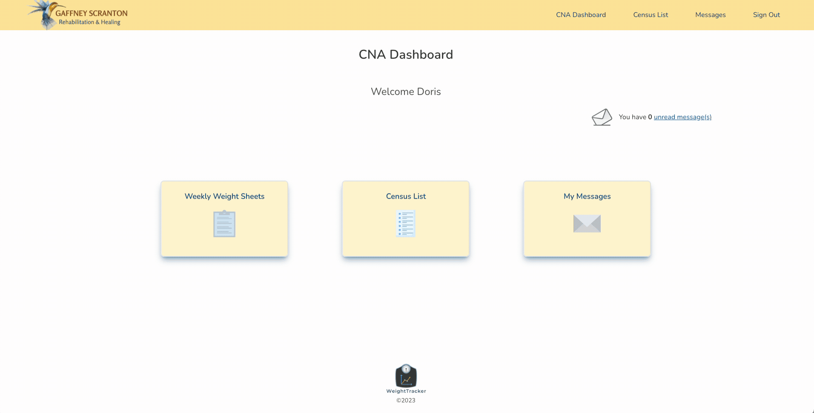

# WeightTracker 

## ***An app to prevent unintentional weight loss in health care facilities*** 
>View Deployed App: [WeightTracker](https://weight-tracking-client.vercel.app/)<br>
    - Register a new employee or sign in as a guest user
 <br><br>

# Application Overview  

>In a health care setting, unintentional weight loss is associated with adverse clinical outcomes and decline, especially in the elderly. Therefore, it is an important quality indicator for long term care and some skilled nursing/rehab facilities. Although the facility’s registered dietitian (RD) is commonly responsible for this quality indicator, interventions to prevent or treat weight loss are often multifaceted and require an interdisciplinary approach. 

>WeightTracker is a full-stack application I created as my final capstone project for Nashville Software School. The app is designed to be used in conjunction with a facility's EMR to allow the RD to obtain patient weights timely and systematically. It is also designed to identify patients at risk, display weight trends over time, and allow fast and efficient communication between disciplines.

>To demonstrate this application, a fictitious rehab and long term care facility called Gaffney Scranton Rehab and Healing (GSHR) was created. Users of WeightTracker include trained Certified Nursing Assistants (CNAs), RDs, Registered Nurses(RNs) and Licensed Practical Nurses (LPNs), Nurse Practitioners(NPs), and MDs. 

# Features
There are three primary types of users that can register and log in to their account: (CNA, RD, and RN/NP/MD).<br>
Responsive design allows for use on most screen sizes.<br>

Each user has different responsibilities:  
1. From their dashboard, CNAs can:
    - check and send messages to multiple users
    - view the current census list
    - create a new weight sheet    
    - view previous weight sheets
    - save and update entered data at any time before the weight sheet is finalized by the RD
2. From their dashboard, RDs can:
    - check and send messages to multiple users
    - view the current census list
    - view, edit, save and finalize a weight sheet
    - view previous weight sheets
    - submitted weight sheet highlights missing or concerning data for RD to investigate
    - search for individual patients by name and view a table and graph of weight trends over a 6 month period to monitor significant weight changes
3. From their dashboard, RNs/NPs/MDs can:
    - check and send messages to multiple users
    - view current census list
    - view finalized weekly weight sheets 

# User Experience
## Register a new user and sign in to view  CNA dashboard


## CNA creates a new weekly weight sheet and saves data


## CNA completes weight sheet and sends message to RD and RN


## RD checks messages, finalizes weight sheet, and notifies MD and NP of resident at risk


## RD searches by resident to view 6 month summary of weight history


## RN/LPN/NP/MD can check messages and view finalized weight sheets from dashboard


## Responsive layout using Tailwind CSS


# Technologies


 

 


## Installation Instructions

Requirements: [NPM](https://www.npmjs.com/)

1. In the terminal, run  ```git clone https://github.com/mvdutta/weight-tracking-client.git```
2. Move into the folder you just created ```cd weight-tracking-client```
3. Run ```npm install```
4. Run ```npm start```
5. This will bring up a browser window showing the react app, but you won't be able to log into the site or access data without running the database side of this project. 
6. To download and start the server, go to [https://github.com/mvdutta/weight-tracking-api](https://github.com/mvdutta/weight-tracking-api) and follow the readme there.
7. Once the backend is running, you can explore the app by registering a new user in any of the available roles (CNA, RD, LPN, RN, NP, MD) 
   
 
## Author
### Maia Dutta
[](https://github.com/mvdutta)
[](https://www.linkedin.com/in/maia-v-dutta/)
[](https://maiadutta.com)


